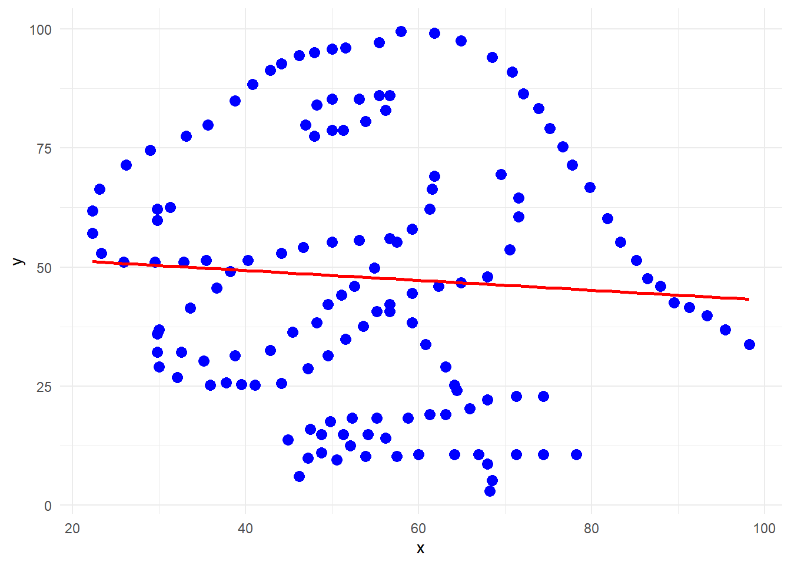

# **Herramientas utilizadas para la regresión lineal**
* **ggplot2:** Es la biblioteca en R que permite crear gráficos de alta calidad y personalizables. 
* **geom_smooth():** es parte de esta biblioteca.
* **lm (Linear Model):** Es el método utilizado por geom_smooth para ajustar una línea de regresión lineal a los datos.


# **Componentes**
**1. geom_point():**

* Dibuja los puntos de los datos (x e y) como una gráfica de dispersión.
* El tamaño de los puntos es 3 y el color es azul.

**2. geom_smooth(method = "lm", color = "red", se = FALSE):**

* **geom_smooth:** Dibuja una curva suavizada, que puede ser de varios tipos dependiendo del método seleccionado.
* **method = "lm":** Indica que se debe usar regresión lineal (Linear Model, abreviado como "lm").
* **color = "red":** La línea de regresión lineal se dibuja en rojo.
* **se = FALSE:** El parámetro se controla si se muestra o no la sombra de error estándar alrededor de la línea de regresión. En este caso, se establece en FALSE para no mostrarla.

**3. theme_minimal():**

* Aplica un tema minimalista al gráfico, eliminando bordes y detalles no esenciales para que el gráfico sea más claro y limpio.

# **Código**

```r
# Crear la gráfica con la línea de regresión
ggplot(dfgrupo, aes(x = x, y = y)) +
  geom_point(size = 3, color = "blue") +
  geom_smooth(method = "lm", color = "red", se = FALSE) +
  theme_minimal()
```


